# 🏠 HiveLink - Smart Home Automation System

### IT1140 - Fundamentals of Computing Project (SLIIT)

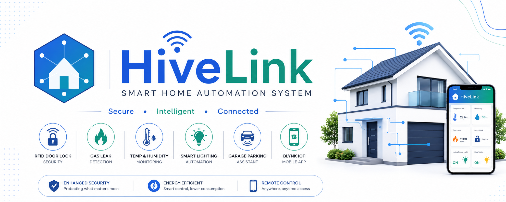

HiveLink is an IoT-based Smart Home Automation System developed using **ESP32** and **Arduino Uno**. The system provides **RFID door access, gas leak detection, temperature & humidity monitoring, automatic fan control, smart lighting, parking assistance**, and **remote monitoring through the Blynk IoT app**.

---

## 📖 Overview

HiveLink is an IoT-based Smart Home Automation System developed using ESP32 and Arduino Uno. It provides smart lighting, RFID door access, gas leak detection, climate monitoring, and parking assistance with remote control through the Blynk IoT app.

- **Project Code:** Y1S1Mtr02
- **Module:** IT1140 - Fundamentals of Computing
- **Academic Year:** Year 1 Semester 1 - 2025
- **Version:** v1.0
- **Status:** Ready for Demonstration

---

## ✨ Key Features

- **RFID Door Lock Security** – Secure home access using RFID cards or tags.

- **Smart Fence & Rooftop Lighting** – Automatically turns ON lights using the LDR sensor when ambient light is low.

- **Garage Parking Assistant** – Uses an Ultrasonic Sensor and buzzer to assist parking when the vehicle is too close.

- **Temperature & Humidity Monitoring** – Monitors environmental conditions using the DHT11 sensor.

- **Automatic 12V DC Fan Control** – Turns ON automatically when temperature exceeds **30°C** or humidity exceeds **60%**.

- **MQ-5 Gas Leak Detection** – Detects harmful gases and activates the buzzer with an alert message.

- **Blynk IoT Mobile Application** – Provides real-time monitoring of temperature, humidity, gas levels, and device status.

- **Remote Light Control** – Allows users to turn indoor lights ON or OFF remotely through the Blynk app.

- **LCD Real-Time Display** – Displays temperature, humidity, gas level, fan status, and light status.

---
## 📸 Project Gallery
### 🛠 Hardware Implementation

### 🏠 Smart Home Overview

| Complete Smart Home Model | Rooftop Garden & Lighting |
|:-------------------------:|:-------------------------:|
| 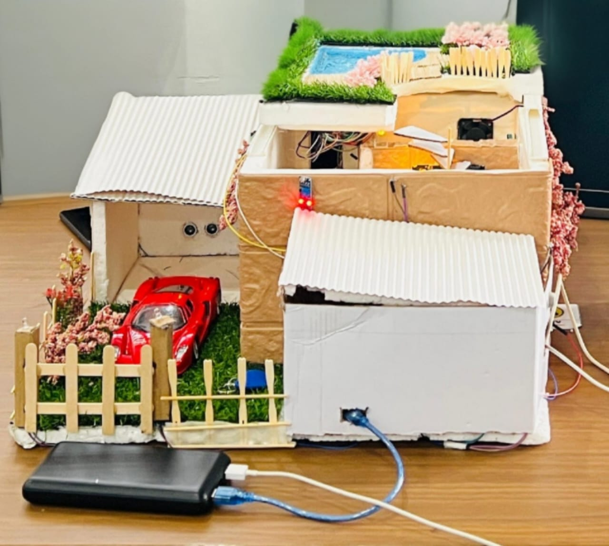 | 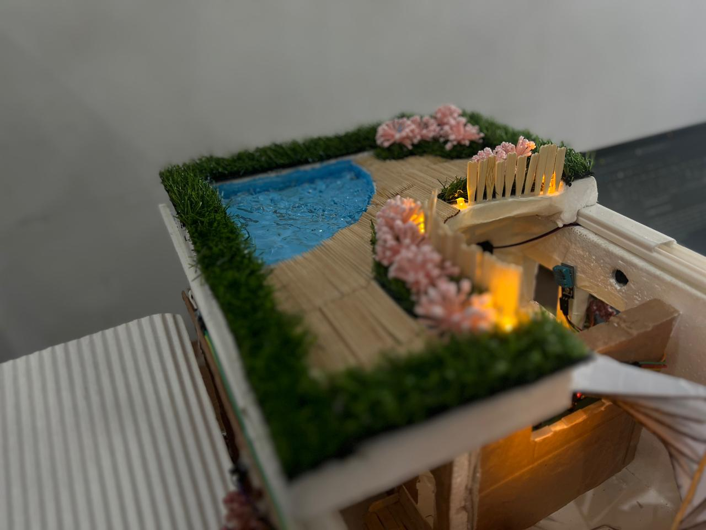 |

---

### 💡 Smart Lighting & Security

| App Controlled Lights | Fence Lights, RFID & Ultrasonic |
|:---------------------:|:-------------------------------:|
| 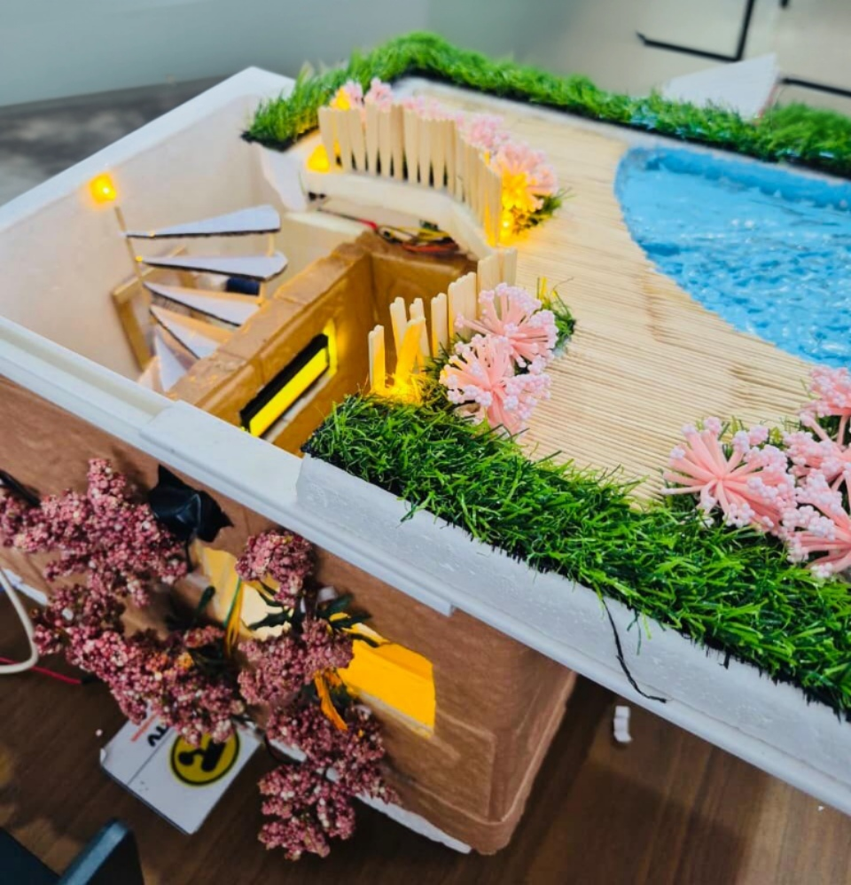 | 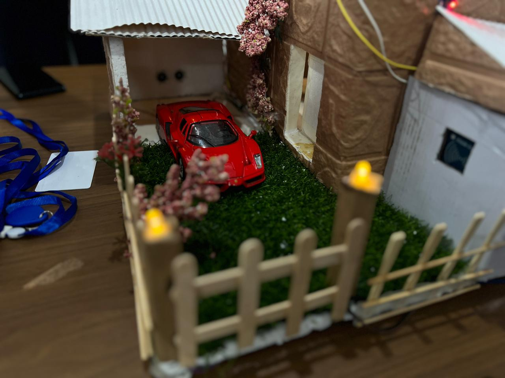 |

---

### 🌡 Environment Control

| DHT11 , 12V DC Fan System and MQ5 - Buzzer | LCD Display |
|:-----------------:|:-----------:|
|  | 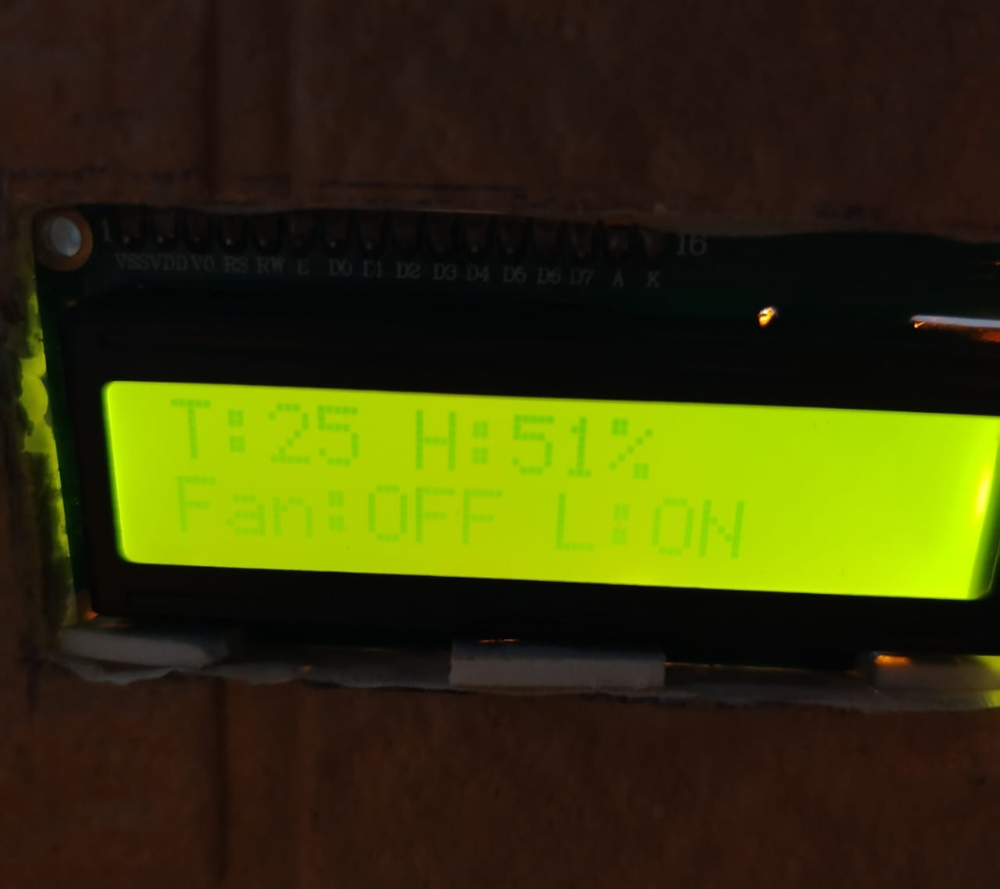 |

---

### 📱 Blynk IoT Mobile Dashboard

| Blynk IoT Mobile Dashboard |
|:--------------------------:|
| 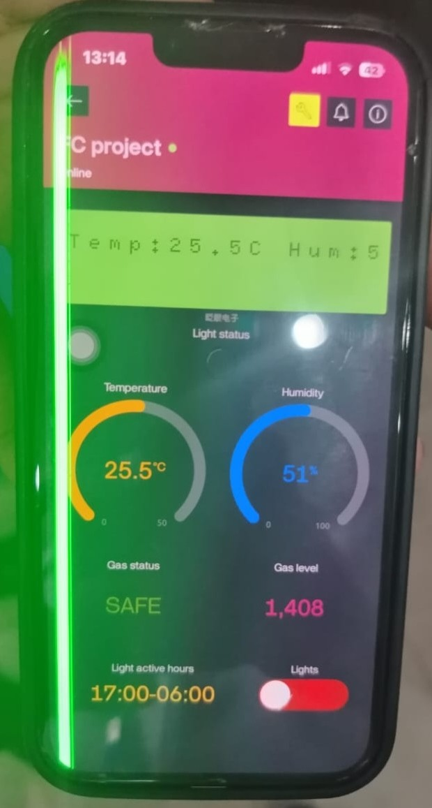 |

---
### 🔧 System Internals

| DHT11 Temperature & Humidity | MQ-5 Gas Detection | Ultrasonic & LDR Module |
|:----------------------------:|:------------------:|:-----------------------:|
| 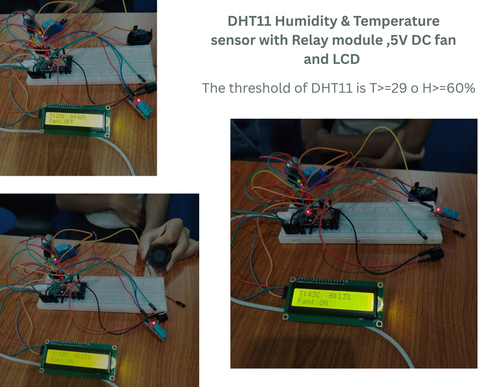 | 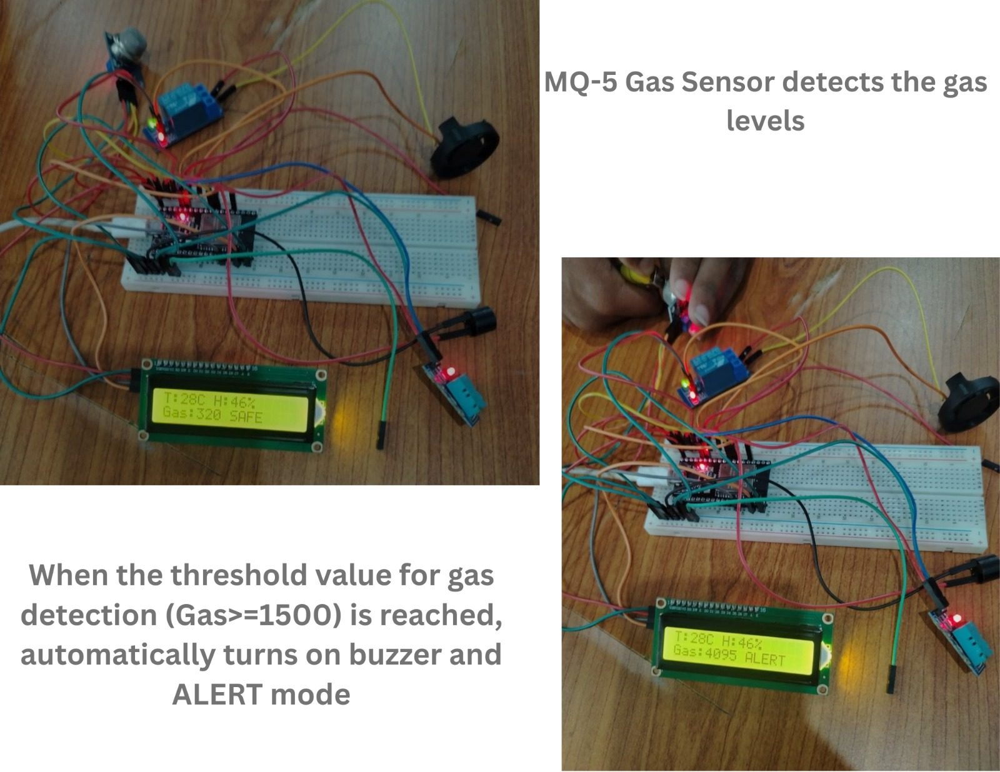 | 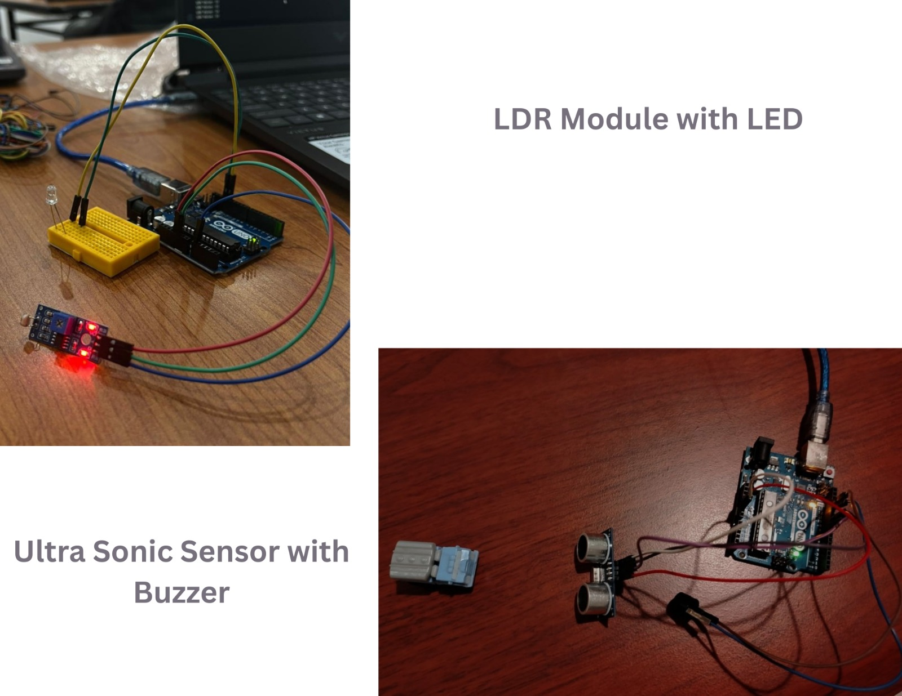 |

---
## 🛠 Hardware Components

- **Microcontrollers:** ESP32 DevKit V1, Arduino Uno
- **Sensors:** DHT11, MQ-5, LDR Module, Ultrasonic Sensor (HC-SR04), RFID Module (RC522)
- **Actuators:** 12V DC Fan, Relay Module, Active Buzzer
- **Displays & Indicators:** 16x2 LCD Display, LED Lights
- **Communication:** Wi-Fi (ESP32), Blynk IoT Platform
- **Power Supply:** USB Power Bank / 5V DC Supply

---
## 🏗 System Architecture

### Overall System Architecture

  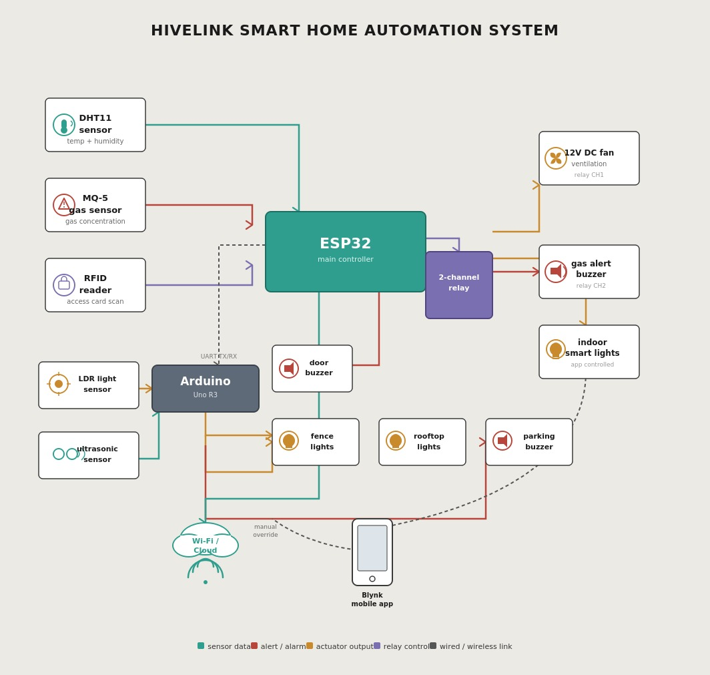

This diagram illustrates the interaction between the ESP32, Arduino Uno, sensors, actuators, and the Blynk IoT platform within the HiveLink Smart Home Automation System.

---

### Internal Circuit Connections

  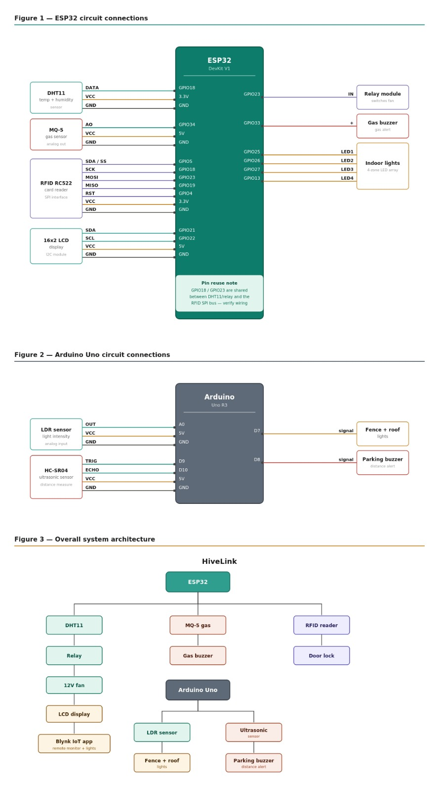

This diagram presents the detailed internal wiring connections of the ESP32 and Arduino Uno, including DHT11, MQ-5 Gas Sensor, RFID RC522, LCD Display, LDR Module, Ultrasonic Sensor, Relay Module, 12V DC Fan, Indoor Lights, and Buzzers.

### Power Management

The HiveLink Smart Home Automation System uses separate power supplies for the ESP32 and Arduino Uno to ensure stable performance.

1. **ESP32 Unit:** Controls DHT11, MQ-5, RFID, LCD, relay, indoor lights, fan, and gas alert buzzer.

2. **Arduino Uno Unit:** Controls the LDR module, Ultrasonic sensor, fence lights, rooftop lights, and parking buzzer.

This design minimizes power interference and improves system reliability.

---
<h2>👥 Team Members & Responsibilities (Y1S1Mtr2)</h2>

<table>
  <tr>
    <th>IT Number</th>
    <th>Name</th>
    <th>Primary Responsibility</th>
    <th>Key Contributions</th>
  </tr>

  <tr>
    <td><b>IT25102735</b></td>
    <td>Jayasekara E.O.</td>
    <td>Temperature Monitoring System</td>
    <td>DHT11 temperature and humidity monitoring, 12V DC fan control using relay module, and LCD display for real-time environmental data.</td>
  </tr>

  <tr>
    <td><b>IT25102198</b></td>
    <td>Nisanka P.G.U.</td>
    <td> Parking System</td>
    <td> ultrasonic sensor integration, and parking assistance alerts.</td>
  </tr>

  <tr>
    <td><b>IT25102205</b></td>
    <td>Hewamana Y.C.K.</td>
    <td>Gas Detection , Safety  & Smart Security </td>
    <td>MQ-5 gas sensor integration, gas level monitoring, and gas alert buzzer system.RFID card authentication, door access control</td>
  </tr>

  <tr>
    <td><b>IT25102657</b></td>
    <td>Thirasara K.W.D.D.</td>
    <td>Smart Lighting System</td>
    <td>LDR-based fence and rooftop lights, indoor smart lights, and Blynk IoT application control.</td>
  </tr>

  <tr>
    <td><b>IT25102894</b></td>
    <td>Wijesinghe Y.N.</td>
    <td>System Architecture</td>
    <td>Designed system architecture, circuit diagrams, integration of ESP32 and Arduino Uno, and overall system coordination.</td>
  </tr>

</table>

---

## 📁 Documentation

Access the complete project documents below:

- [ Project Proposal](docs/Project_Proposal_Y1S1_Mtr2.pdf)
- [ Progress Report](docs/IT1140_Progress_Report_Mtr02.pdf)
- [ User Manual](docs/HiveLink_User_Manual.pdf)

---

## ⚙️ Installation & Setup

1. Install the required libraries:
   - Blynk
   - DHT sensor library
   - MFRC522
   - LiquidCrystal I2C

2. Configure the Blynk Template ID and Auth Token.

3. Connect all sensors and modules according to the circuit diagram.

4. Upload the code to ESP32 and Arduino Uno using Arduino IDE.

---

## 🔮 Future Enhancements

- Voice assistant integration using Google Assistant or Alexa.
- Face recognition for secure door access.
- Real-time energy consumption monitoring.
- Solar power and battery backup integration.

---

## 👨‍💻 Project Lead

**Enuri Jayasekara**  
Group Leader | IoT Developer | System Integrator

---

### 📚 Developed For

This project was developed as part of the **IT1140 – Introduction to Computer Systems** module at the **Sri Lanka Institute of Information Technology (SLIIT)**.

